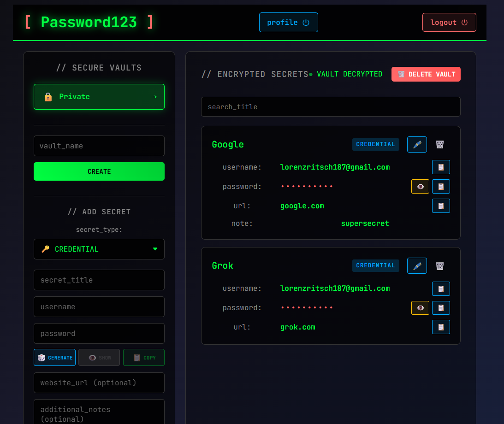
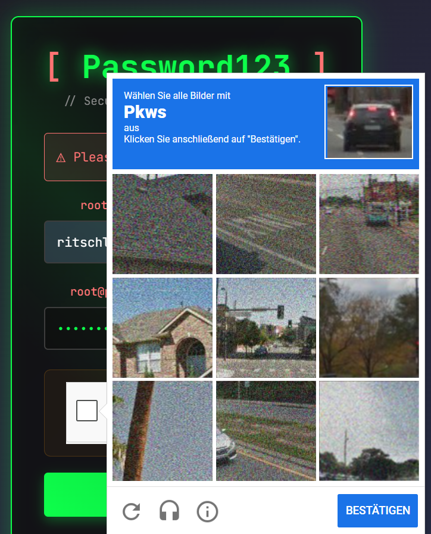

# Project Security Report
Read about the final project report [here](./security_report.pdf)

## **Project Overview**

This project is a full-stack password manager consisting of:

* A **FastAPI backend**
* A **Svelte frontend**
* A **PostgreSQL** database
* A **Docker-based** monitoring and logging stack
* An **Nginx** reverse proxy

The application implements secure JWT authentication, CSRF protection, 2-factor authentication (TOTP), encrypted secret storage, rate-limiting, Google reCAPTCHA, and full observability through Loki + Grafana.

